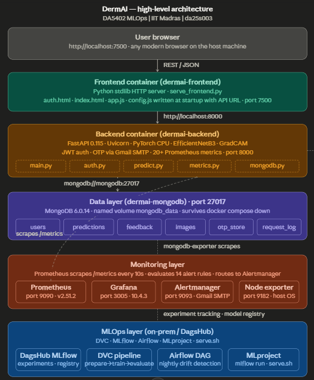
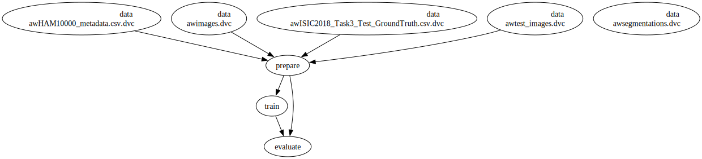
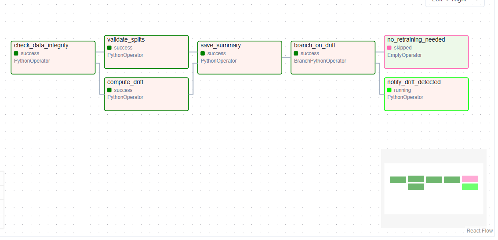

# DermAI — Skin Disease Detection System

> End-to-end MLOps application for dermoscopy image classification.  
> **DA5402 | IIT Madras | Harshit (da25s003)**

[](https://dagshub.com/da25s003/E2E_Project_DA5402)
[](https://dagshub.com/da25s003/E2E_Project_DA5402.mlflow)
[](https://dagshub.com/da25s003/E2E_Project_DA5402.mlflow/#/experiments/0/runs/431cd8226fbe4250af9793e57b059ca5)

**Project REPORT**:   `Project_reports\E2E_REPORT.pdf`

**HLD REPORT**:   `Project_reports\HLD_DermAI.pdf`

**LLD REPORT**:   `Project_reports\LLD_DermAI.pdf`

**TestPlan REPORT**:   `Project_reports\TestPlan_DermAI.pdf`

**USERMANUAL REPORT**:   `Project_reports\UserManual_DermAI.pdf`

**RECORDING**:   `E2E_RECORDING.mp4`
```bash
[00:00 - 03:40] - docker compose discussion
[03:41 - 06:12] - Codebase [monitoring, dockerization, and scripts] and Reports discussion
[06:13 - 07:12] - Web UI & Application demonstration
[07:13 - 07:55] - Grafana Dashboard discussion
[08:00 - 09:05] - Airflow DAG pipeline & MLFLOW experiment
[09:06 - 11:44] - Codebase [Preparation, backend-frontend, db, training, inference, and logging] discussion
[11:45 - 12:50] - DVC and MLFLOW experiments run
[12:50 - 13:30] - library requirements discussion & soft coding paths discussion
[13:31 - 13:54] - MongoDB compass
[13:55 - 14:10] - Conclusion
```
---

## Architecture

<!-- Insert HLD diagram image here -->
> **HLD diagram:** `project_reports/HLD_DermAI.pdf`


---

## Quick Start (Docker)

```bash
# 1. Clone and pull data
git clone https://dagshub.com/da25s003/E2E_Project_DA5402.git
cd E2E_Project_DA5402
dvc pull                          # restores data/ and best_model_cpu.pth

# 2. Configure secrets
cp .env.example .env              # fill JWT_SECRET_KEY, GMAIL_APP_PASS, AIRFLOW__CORE__FERNET_KEY

# 3. Prepare directories and Airflow DAG
mkdir -p logs backups dags
cp src/test/dermai_ingestion_dag.py dags/

# 4. Start all services
docker compose --env-file .env up --build -d
# wait ~90s for model to load on CPU
```

### Service URLs

| Service | URL | Credentials |
|---|---|---|
| Frontend | http://localhost:7500 | register an account |
| API / Swagger | http://localhost:8000/docs | — |
| Grafana | http://localhost:3005 | admin / admin |
| Prometheus | http://localhost:9090 | — |
| Alertmanager | http://localhost:9093 | — |
| Airflow | http://localhost:8080 | admin / admin |

---

## Directory Structure

```
E2E_Project_DA5402/
│
├── dvc.yaml                    # DVC pipeline: prepare → train → evaluate
├── params.yaml                 # All hyperparameters (single source of truth)
├── MLproject                   # mlflow run . entry points
├── python_env.yaml             # Reproducible Python environment spec
├── docker-compose.yml          # 10-service orchestration
├── docker-requirements.txt     # CPU-only pip requirements for Docker image
│
├── docker/
│   ├── backend.Dockerfile      # uv + layer-cache optimised, Python 3.10-slim
│   ├── frontend.Dockerfile     # Lightweight stdlib HTTP server image
│   └── mongod.conf             # Suppresses verbose WiredTiger logs
│
├── dags/
│   └── dermai_ingestion_dag.py # Airflow nightly drift detection DAG
│
├── monitoring/
│   ├── prometheus.yml          # Scrape configs (backend, node, mongo exporters)
│   ├── rules.yml               # 14 alert rules (CPU, memory, latency, abuse)
│   ├── alertmanager.yml        # Gmail SMTP routing (template: .yml.template)
│   ├── grafana_dashboard.json  # Auto-provisioned Grafana dashboard
│   └── grafana/provisioning/   # Datasource + dashboard provisioning configs
│
├── src/
│   ├── api/
│   │   ├── main.py             # FastAPI app, lifespan, background metrics thread
│   │   ├── auth.py             # Signup, OTP verify, login, profile endpoints
│   │   ├── predict.py          # /predict, /explain, /feedback (run_in_executor)
│   │   ├── metrics.py          # 25+ Prometheus Counter/Gauge/Histogram definitions
│   │   ├── deps.py             # JWT decode, get_current_user dependency
│   │   ├── serve_frontend.py   # Writes runtime config.js then serves static files
│   │   └── frontend/           # auth.html, index.html, app.js, auth.js, *.css
│   │
│   ├── db/
│   │   ├── mongodb.py          # Lazy-reconnect MongoDB client (_ensure_connected)
│   │   └── models.py           # Pydantic schemas for all collections
│   │
│   ├── models/
│   │   ├── model.py            # EfficientNetB3 builder (7-class head)
│   │   ├── train.py            # Training loop, MLflow logging, early stopping
│   │   ├── inference.py        # Evaluate + register model to MLflow registry
│   │   └── aug_methods.py      # Mixup / CutMix augmentation
│   │
│   ├── data_proc/
│   │   ├── prepare.py          # Lesion-level stratified split, baseline stats
│   │   └── verify_files.py     # Image integrity checks against metadata CSV
│   │
│   ├── utils/
│   │   ├── logger.py           # Structured logging setup
│   │   ├── mlflow_utils.py     # MLflow helper wrappers
│   │   ├── email_otp.py        # Gmail SMTP OTP sender
│   │   ├── reproducibility.py  # set_seed (torch, numpy, random)
│   │   └── serve_weights.py    # Downloads CPU weights from MLflow registry
│   │
│   └── test/
│       ├── run_tests.py        # Unified test suite (easy/moderate/rigorous/overall)
│       └── data_creation.py    # Samples 100 ISIC images into test/test_samples/
│
├── outputs/models/
│   └── best_model_cpu.pth      # CPU state-dict weights (DVC tracked)
│
├── data/                       # DVC tracked — restored via dvc pull
│   ├── raw/                    # HAM10000 images + metadata CSV
│   ├── processed/              # train.csv, val.csv, test.csv
│   └── reports/                # baseline_stats.json, drift_report.json
│
└── scripts/
    ├── backup_mongodb.sh       # mongodump → ./backups/ without wiping volume
    ├── restore_mongodb.sh      # mongorestore from a backup directory
    └── serve.sh                # mlflow models serve @production on port 5001
```

---

## DVC Pipeline

```
prepare → train → evaluate
```

Each stage reads from `params.yaml`. Changing any param or input automatically invalidates downstream stages.

```bash
dvc repro              # run full pipeline
dvc metrics show       # compare F1 across runs
dvc push               # sync data + model to DagsHub
```

<!-- Insert DVC DAG image here -->
> **DVC DAG image:** `project_reports/dvc_dag.png`  *(generated with `dvc dag --dot | dot -Tpng > dvc_dag.png`)*

---

## Model Serving

Two modes, controlled by `USE_REMOTE_MODEL` in `.env`:

| Mode | How | When |
|---|---|---|
| `false` (default) | `torch.load(best_model_cpu.pth, weights_only=True)` | CPU deployment, any OS |
| `true` | `mlflow models serve` via `scripts/serve.sh` | GPU machine with compatible Python |

The CPU path bypasses MLflow pickle serialisation, avoiding Python/CUDA version incompatibility between the Linux training machine and Windows serving machine.

```bash
# Reproduce training (GPU recommended)
mlflow run . --env-manager local -e train_and_evaluate
```

---

## Airflow — Drift Detection DAG

Schedule: `0 2 * * *` (2 AM nightly). Computes PSI, Jensen–Shannon divergence, and total variation distance against `data/reports/baseline_stats.json`.

<!-- Insert Airflow DAG image here -->
> **DAG graph image:** `project_reports/airflow_dag.png`

```
check_data_integrity
    ↓           ↓
compute_drift  validate_splits
         ↓
      save_summary
         ↓
    branch_on_drift
     /           \
notify_drift    no_retraining
_detected        _needed
```

Triggers an alert email (not `dvc repro`) on CPU-only machines — retraining is reviewed and run manually on a GPU environment.

**Enable DAG:** Airflow UI → `dermai_data_ingestion` → toggle ON → ▶ Trigger DAG.

---

## Testing

```bash
pip install requests pymongo Pillow numpy
python src/test/data_creation.py           # sample 100 real ISIC images

python src/test/run_tests.py --mode easy       # 14 connectivity checks
python src/test/run_tests.py --mode moderate   # 22 auth + prediction tests
python src/test/run_tests.py --mode rigorous   # 63 load + integrity + alert tests
python src/test/run_tests.py --mode overall    # full suite + deliberate errors
```

Results: **99% passed** across all modes.  
Full test plan: `project_reports/TestPlan_DermAI.pdf`

---

## Environment Variables (`.env`)

Copy `.env.example` → `.env` and fill these required fields:

| Variable | Example | Note |
|---|---|---|
| `MODEL_PATH` | `outputs/models/best_model_cpu.pth` | CPU state-dict |
| `DEVICE` | `cpu` | `cpu` or `cuda` |
| `IMAGE_SIZE` | `336` | Must match training |
| `MONGO_URI` | `mongodb://mongodb:27017` | Docker service name |
| `JWT_SECRET_KEY` | 32-char hex | `python -c "import secrets; print(secrets.token_hex(32))"` |
| `GMAIL_APP_PASS` | 16-char app password | OTP emails + Alertmanager |
| `AIRFLOW__CORE__FERNET_KEY` | base64 key | `python -c "from cryptography.fernet import Fernet; print(Fernet.generate_key().decode())"` |
| `GRAFANA_PORT` | `3005` | Avoids conflict with default 3000 |

---

## Requirements

**Docker image** (`docker-requirements.txt`) — CPU-only, installed via `uv` with layer caching:

```
fastapi, uvicorn, torch (CPU), torchvision, efficientnet-pytorch
pymongo, pydantic, python-jose[cryptography], passlib
prometheus-client, psutil, grad-cam, Pillow, numpy
python-multipart, httpx, mlflow, dvc
```

**Local dev / tests** — install into a venv:

```bash
pip install requests pymongo Pillow numpy          # test runner only
pip install -r docker-requirements.txt             # full backend stack
```

---

## Documentation

All detailed documents are in `project_reports/`:

| File | Contents |
|---|---|
| `HLD_DermAI.pdf` | Architecture diagram and design rationale |
| `LLD_DermAI.pdf` | All 16 API endpoint I/O specifications |
| `TestPlan_DermAI.pdf` | Test cases, acceptance criteria, results |
| `UserManual_DermAI.pdf` | Non-technical step-by-step usage guide |
| `Grafana_dashboard.pdf` | Dashboard screenshots and panel descriptions |

---

> **Disclaimer:** Academic project only. Not a certified medical device. Results must not be used as the sole basis for any clinical decision.